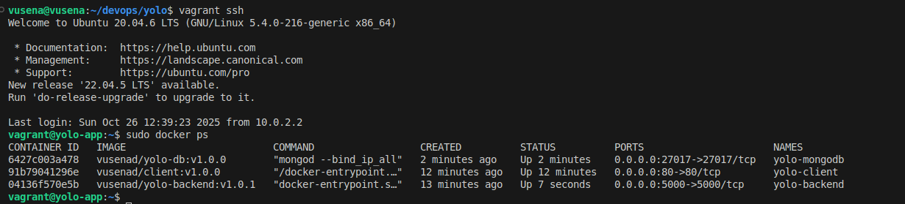
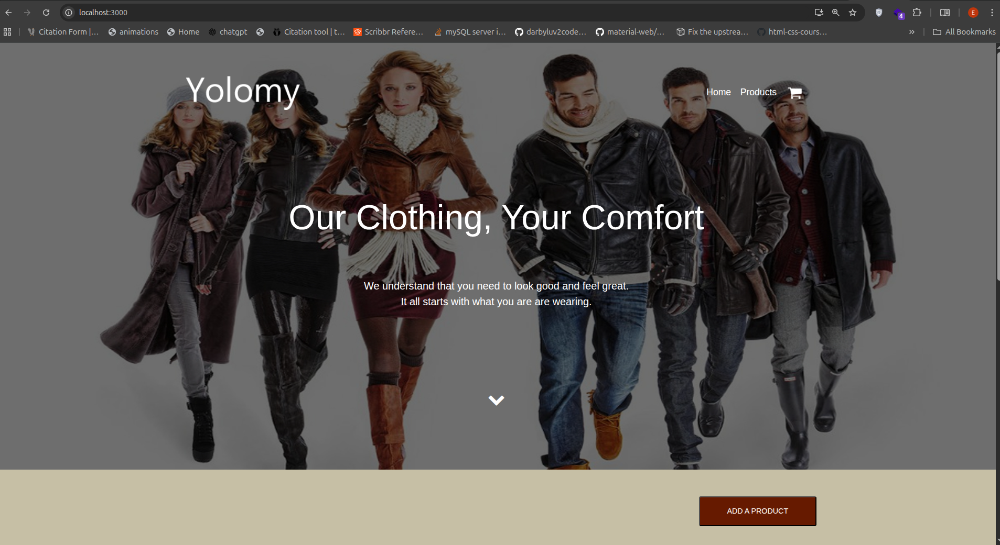

# Overview
This project involved the containerization and deployment of a full-stack yolo application using Docker.


# Requirements
Install the docker engine here:
- [Docker](https://docs.docker.com/engine/install/) 

## How to launch the application 


## How to run the app
Use vagrant up --provison command


Installing mongo db locally 

Downloaded the .deb file (e.g., mongodb-org-server_8.2.0_amd64.deb),
#Installing mongodb 
- cd Downlaods
- sudo dpkg -i mongodb-org-server_8.2.0_amd64.deb 
# Checking the status of mongodb 
- sudo systemctl status mongod.service
- sudo systemctl start mongod.service

#Downloading mongodb shell
-sudo dpkg -i mongodb-mongosh_2.5.8_amd64.deb 
-mongosh

#Back the application
-I ran node server.js
-Mongoose automatically connects to MongoDB at localhost:27017/yolomy.

# To fire up the client
-cd client/
-npm install 
-npm start
-if you encounter this error ---> Error: error:0308010C:digital envelope routines::unsupported
 try this command instead 
 -export NODE_OPTIONS=--openssl-legacy-provider
 -npm start


 #### IP3 - CONFIGURATION MANAGEMENT
 # Yolo App - Configuration Management Project (Stage 1)
This project demonstrates automated environment setup using **Vagrant** and **Ansible** for a containerized e-commerce application.

### STAGE 1: ANSIBLE INSTRUMENTATION
##  Environment Setup
I use **Vagrant** to provision an Ubuntu 20.04 virtual machine using Jeff Geerling’s image.  
This provides a clean, reproducible environment for deploying the e-commerce application.

## Technologies
- **Vagrant** (Virtual Machine Provisioning)
- **VirtualBox** (VM Provider)
- **Ansible** (Configuration Management)
- **Ubuntu 20.04 (geerlingguy/ubuntu2004)**

## How to Run
1. Clone this repository:
   ```bash
   git clone https://github.com/Vusena/yolo
   cd yolo-app
2. Start the virtual machine:  
   vagrant up
3. Once provisioning completes, your VM will be running with:
   Hostname: yolo-app
   Forwarded port: 3000 (access via http://localhost:3000)
   Ansible Playbook: playbook.yml (automatically triggered by Vagrant)
4. To SSH into the VM:
   vagrant ssh

 ### STAGE 2: ANSIBLE CONFIGURATIONS SETUP
After provisioning the Vagrant VM, the next step involves configuring Ansible to automate application deployment.
Files Added:
playbook.yml – The main Ansible playbook that defines how the YOLO app environment is configured and deployed.
roles/ – Directory containing modular role definitions for each component (e.g., backend, frontend, and database).
ansible.cfg – Ansible configuration file that defines the default inventory path, disables host key checking, and ensures Ansible uses the correct Python interpreter.
hosts – The Ansible inventory file listing the target host (the Vagrant VM).

### STAGE 3: YOLO APP CONFIGURATION MANAGEMENT (ANSIBLE INSTRUMENTATION)
This project automates the provisioning, configuration, and deployment of the **YOLO E-commerce App** using **Ansible** and **Vagrant**.  
It replaces manual Docker Compose orchestration with infrastructure automation through Ansible roles and playbooks.


## — Ansible Playbook Overview
The `playbook.yaml` file defines how Ansible provisions and configures the YOLO application environment.  
It uses **roles**, **variables**, **tags**, and **blocks** to ensure modular, reusable, and maintainable automation.

## Key Components
| Section | Purpose |
|----------|----------|
| `hosts: yolo` | Defines the target host group from the inventory file (`hosts`). |
| `become: yes` | Runs tasks with administrative privileges. |
| `vars` & `vars_files` | Stores variables used across roles and tasks. |
| `pre_tasks` | Updates packages before running other tasks. |
| `roles` | Modular task definitions for common setup, Docker installation, and app deployment. |
| `post_tasks` | Displays confirmation message once setup completes successfully. |

## Tags Used
| Tag | Purpose |
|------|----------|
| `setup` | For system preparation tasks |
| `docker` | For Docker-related roles |
| `backend`, `frontend`, `mongo` | For individual app components |
| `confirmation` | For post-deployment success checks |

## How to Run the Project
1. Start the virtual machine:
   vagrant up

## STAGE 4: ANSIBLE CONFIGURATION
In this stage, we prepared the Ansible configuration that will control how the YOLO App environment is provisioned and deployed inside the Vagrant VM.

###Files Added
- **ansible.cfg** — defines Ansible’s global defaults, including:
  - `remote_user = vagrant` → the SSH user for connecting to the Vagrant VM
  - `private_key_file = .vagrant/machines/default/virtualbox/private_key` → path to the auto-generated SSH key
  - `inventory = hosts` → sets the default inventory file

- **hosts** — defines the managed nodes (in this case, the Vagrant VM itself).

### Host Configuration
Since this project only uses a single Vagrant-managed server, our `hosts` file is minimal:
[yolo]
default ansible_host=127.0.0.1 ansible_port=2222

### STAGE 5: DEFINING ROLES
## Role: common
The **common** role prepares the base environment for the YOLO App. It ensures the system is updated and has essential packages required by subsequent roles.

**Key tasks include:**
- Updating and upgrading system packages  
- Installing essential utilities (curl, git, vim, unzip, htop)  
- Ensuring the `app_user` exists  
- Creating the project root directory

## Role: docker 
Automates the installation and configuration of Docker and Docker Compose.
- Installs all prerequisites  
- Adds Docker’s GPG key and APT repository  
- Installs Docker Engine and CLI  
- Downloads and sets up Docker Compose  
- Starts and enables Docker service  

## Role: backend
# Tasks performed:
- Copies the backend source code and Dockerfile to the remote host.
- Builds a Docker image named `yolo-backend`.
- Runs the container exposing port `5000`.

**Tag to run:**
ansible-playbook playbook.yaml --tags "backend"

## Role: client
This role handles deployment of the YOLO client React frontend.
# Tasks performed:
1. Creates the `/home/ubuntu/client` directory on the target host.
2. Copies the React source code and Dockerfile to the host.
3. Builds a Docker image named `yolo-client`.
4. Runs the container exposing port `3000` mapped to container port `80`.

**Tag to run:**
ansible-playbook playbook.yaml --tags "client"

## MongoDB Role
This role handles deployment of the YOLO MongoDB database.
# Tasks performed:
1. Creates the `/home/ubuntu/mongodb` directory on the target host.
2. Copies MongoDB Dockerfile and configuration files to the host.
3. Builds a Docker image named `yolo-mongo`.
4. Runs the container exposing port `27017` and mounts persistent storage at `/home/ubuntu/mongo-data`.

**Tag to run:**
ansible-playbook playbook.yaml --tags "mongodb"

### Verification & Evidence
After updating the Ansible playbook to pull prebuilt Docker images from Docker Hub instead of building them locally, the application was successfully deployed using:

vagrant up
Once provisioning completed, all containers were confirmed to be running:



Once open your browser and visit:
http://localhost:3000
The Yolo Client UI successfully loaded.


## Update on MongoDB Role
Uses the Docker image vusenad/yolo-db:v1.0.0 from Docker Hub.
Creates a persistent data directory /home/ubuntu/mongodb.
Exposes port 27017 to the host.
Environment variables for credentials are defined in roles/mongodb/vars/main.yml.
Automatically restarts on system reboot or failure.

## Docker Networking
This project deploys a modular client-backend-MongoDB stack using Docker containers orchestrated via Ansible.
## Architecture Overview
- **Client**: React-based frontend served via Docker
- **Backend**: Node.js API container
- **MongoDB**: Database container with persistent volume and credentials
- **Docker Network**: All containers are connected via a shared network (`yolo-net`) for internal communication

## Internal Communication
- Backend connects to MongoDB via:  
  `mongodb://<user>:<password>@yolo-mongodb:27017`
- Client connects to backend via:  
  `http://yolo-backend:5000`


##### YOLO FRONTEND DEPLOYMENT ON GKE
### Phase 1: Frontend Kubernetes Manifests
I have created three files under the frontend folder to facilate deployment of the React frontend using Kubernetes manifests on Google Kubernetes Engine (GKE). It uses a Docker image hosted on Docker Hub and exposes the application via a LoadBalancer service.

## Folder Structure
yolo-manifests/
└── frontend/
    ├── namespace.yaml
    ├── deployment.yaml
    ├── service.yaml

## Deployment Instructions
kubectl apply -f frontend/namespace.yaml
kubectl apply -f frontend/deployment.yaml
kubectl apply -f frontend/service.yaml

## Verify Deployment
kubectl get pods -n yolo-frontend
kubectl get svc -n yolo-frontend

### Phase 2:  Backend Kubernetes Manifests
This phase focuses on deploying the Yolo application backend API within its own isolated Kubernetes Namespace. The backend uses a simple Deployment for horizontal scaling and a ClusterIP Service to expose it internally to the frontend component.

##  Directory Structure
The files for this phase are located under `manifests/backend/`

## Manifest Details
# 1. namespace.yaml
Isolates all backend resources for better organization and security.

apiVersion: v1service.yaml
Creates an internal ClusterIP Service to allow the frontend to communicate with the backend API.

Type: ClusterIP (The backend should not be publicly accessible).

Selector: Targets pods with the label app: yolo-backend.

Internal Access: The frontend can reach this service via the internal DNS name: yolo-backend-service.yolo-backend.svc.cluster.local:5000.
kind: Namespace
metadata:
name: yolo-backend

 # 2. deployment.yaml
Deploys the backend container image (vusenad/yolo-backend:v1.0.2) with 2 replicas and defines resource limits/requests.
Namespace: yolo-backend
Replicas: 2
Container Port: 5000
Environment Variables:
PORT: 5000
MONGODB_URI: mongodb://yolo-db-service.yolo-db.svc.cluster.local:27017/yolomy (Placeholder for the internal database service)
Labels: app: yolo-backend, tier: backend, purpose: api (Crucial for identification and rubric tracking).
Resource Management: Sets best-practice resource requests and limits.

# 3. Service.yaml
Creates an internal ClusterIP Service to allow the frontend to communicate with the backend API.
Type: ClusterIP (The backend should not be publicly accessible).
Selector: Targets pods with the label app: yolo-backend.
Internal Access: The frontend can reach this service via the internal DNS name: yolo-backend-service.yolo-backend.svc.cluster.local:5000.

 ## Deployment Steps 
 kubectl apply -f manifests/backend/namespace.yaml
kubectl apply -f manifests/backend/deployment.yaml
kubectl apply -f manifests/backend/service.yaml

## Verification
kubectl get all -n yolo-backend

### Database Deployment (MongoDB with StatefulSet)
This phase deploys MongoDB using a StatefulSet and PersistentVolumeClaim to ensure data durability and stable pod identity. The database is exposed internally to the backend via a headless service.

## Deployment Instructions
Apply the manifests in order:

kubectl apply -f manifests/database/namespace.yaml
kubectl apply -f manifests/database/pvc.yaml
kubectl apply -f manifests/database/statefulset.yaml
kubectl apply -f manifests/database/service.yaml
# Verification
bash
kubectl get all -n yolo-db
kubectl get pvc -n yolo-db
kubectl describe pod yolo-db-0 -n yolo-db

## Local Deployment Summary

---

## 🚀 Deployment Instructions
Apply manifests in this order:

# Frontend
kubectl apply -f manifests/frontend/namespace.yaml
kubectl apply -f manifests/frontend/deployment.yaml
kubectl apply -f manifests/frontend/service.yaml

# Backend
kubectl apply -f manifests/backend/namespace.yaml
kubectl apply -f manifests/backend/deployment.yaml
kubectl apply -f manifests/backend/service.yaml

# Database
kubectl apply -f manifests/database/namespace.yaml
kubectl apply -f manifests/database/pvc.yaml
kubectl apply -f manifests/database/statefulset.yaml
kubectl apply -f manifests/database/service.yaml

# Verification Summary
**Pods**:
Frontend: 2 pods running, no restarts
Backend: 2 pods running, initial restarts during DB setup
Database: 1 StatefulSet pod running, no restarts

**Services**:
Frontend: LoadBalancer (external access via Minikube tunnel)
Backend: ClusterIP (internal only)
Database: Headless ClusterIP (internal only)

**Access**
minikube service yolo-frontend-service -n yolo-frontend

## Connection String (for backend)
mongodb://yolo-db-service.yolo-db.svc.cluster.local:27017

## Docker Images
Frontend: vusenad/client:v1.0.0
Backend: vusenad/yolo-backend:v1.0.2
Database: vusenad/yolo-db:v1.0.1

# Updating the Client Application for Kubernetes Compatibility

This update ensures that the React frontend correctly communicates with the backend API when deployed inside a Kubernetes cluster. The key changes involve configuring the API endpoint, rebuilding the frontend with the correct environment variables, and pushing the updated image to Docker Hub.

1. Updated .env File
REACT_APP_API_URL=http://yolo-backend-service.yolo-backend.svc.cluster.local:5000
This sets the base URL for API requests to the internal Kubernetes service name of the backend.
It replaces any hardcoded or incorrect references to localhost or unresolved variables.

2. Corrected API Usage in Code
const API_BASE = process.env.REACT_APP_API_URL;

3. Rebuilt the React App
   npm run build
   This compiles the app with the updated environment variable.
   Ensures the final JavaScript bundle contains the correct API URL.

4. Rebuilt and Pushed Docker Image
docker build -t vusena/client:v1.0.6 .
docker push vusena/client:v1.0.6
The new image includes the corrected build.
Tagged and pushed to Docker Hub for deployment.

5. Updated Kubernetes Deployment
image: vusena/client:v1.0.6
Ensures the cluster uses the latest image with the correct API configuration.

   Outcome
These changes ensure that the frontend can successfully communicate with the backend inside the Kubernetes cluster. Products can now be listed and added via the UI, and the application behaves as expected in a containerized environment.