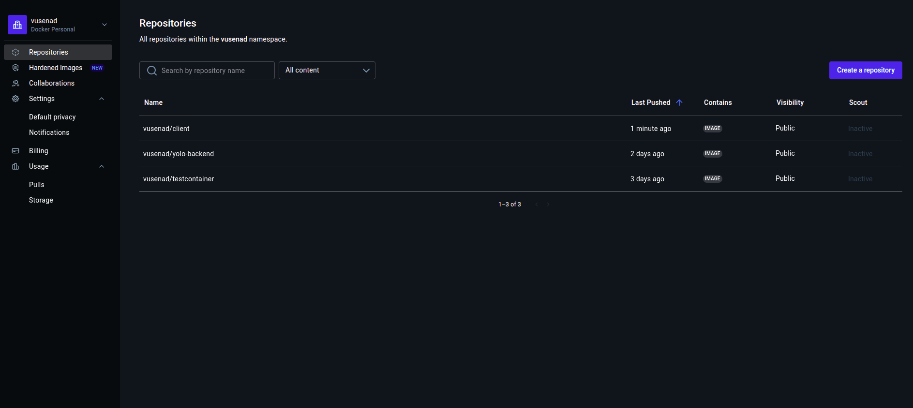
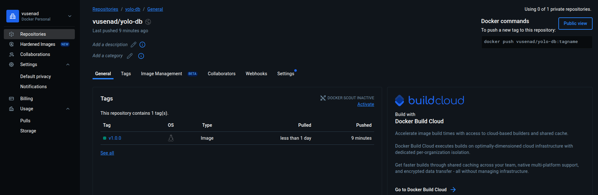
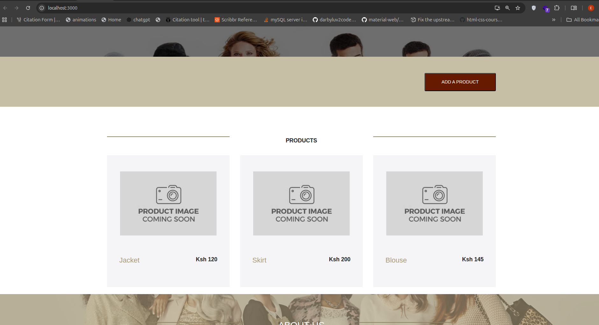

##  BACKEND CONTAINER
#  Comments one the choice of the base image on which to build the container.
The backend container uses node:18-alpine for both the build and production stages. Alpine Linux is preferred for its minimal footprint and security, while Node.js 18 provides long-term support and modern features. This combination ensures a lightweight, fast, and production-ready environment.

 # Dockerfile directives used

FROM node:18-alpine – Specifies the base image for the container.

WORKDIR /app – Sets the working directory inside the container to /app. All subsequent commands, like copying files or running scripts, will execute from this directory.

COPY package*.json ./ – Copies package.json and package-lock.json into the container. This allows installing dependencies without copying the entire source code first, which makes caching more effective.

RUN npm ci --production – Installs only production dependencies, keeping the image smaller and excluding development-only packages.

COPY . . – Copies all backend source files (server.js, routes/, models/, etc.) into the container.

FROM node:18-alpine AS production – Begins the final stage using the same base image.

COPY --from=build /usr/src/app /app – Transfers the built app into the production container.

EXPOSE 5000 – Documents the port that the backend service will listen on. This allows Docker or other services to know which port to map.

CMD ["node", "server.js"] – Sets the default command to run the backend server when the container starts.

# The backend image pushed to DockerHub as shown below

## CLIENT CONTAINER
#  Comments one the choice of the base image on which to build the container.
The client container uses two lightweight, production-grade base images to optimize both build and deployment:
node:18-alpine is used during the build stage. It’s chosen for its minimal size, fast performance, and compatibility with modern Node.js. This image provides a clean environment for installing dependencies and compiling the React app.

nginx:stable-alpine is used in the production stage. It’s ideal for serving static files efficiently, and is known for being lightweight, secure, and widely adopted in frontend deployments.

 # Dockerfile directives used
FROM node:18-alpine AS build - Begins the build stage using Node.js on Alpine Linux.

WORKDIR /app - Sets the working directory inside the container to /app.

COPY package*.json ./ - Copies the package configuration files to prepare for dependency installation.

RUN npm install - Installs all required project dependencies.

COPY . . - Copies the entire application source code into the container.

RUN npm run build - Compiles the React app into an optimized production build

FROM nginx:stable-alpine AS production - Starts the production stage using Nginx to serve the built static files.

COPY --from=build /app/build /usr/share/nginx/html - Transfers the compiled React build from the Node.js stage into Nginx’s default web directory.

EXPOSE 80 - Opens port 80 to allow HTTP traffic.

CMD ["nginx", "-g", "daemon off;"] - Sets the default command to run Nginx in the foreground and serve the application.

 # The backend image pushed to DockerHub as shown below

## DATABASE CONTAINER
#  Comments one the choice of the base image on which to build the container.
The MongoDB container uses debian:bookworm-slim as its base image. This choice balances stability, compatibility, and minimal size:
Debian is a widely supported and secure Linux distribution, ideal for production environments. The bookworm-slim variant strips out unnecessary components, reducing image size while retaining full package manager support. This base ensures compatibility with MongoDB’s official Debian packages and avoids Alpine-related build issues.

 # Dockerfile directives used
FROM debian:bookworm-slim - Begins with a minimal Debian image to keep the container lightweight and secure.

-Set environment variables
ENV MONGO_VERSION=8.0.5
ENV DEBIAN_FRONTEND=noninteractive
-Defines the MongoDB version and disables interactive prompts during package installation.

- Install dependencies required for MongoDB
RUN apt-get update && apt-get install -y \
    curl \
    gnupg \
    && curl -fsSL https://pgp.mongodb.com/server-8.0.asc | gpg --dearmor -o /usr/share/keyrings/mongodb.gpg \
    && echo "deb [signed-by=/usr/share/keyrings/mongodb.gpg] https://repo.mongodb.org/apt/debian bookworm/mongodb-org/8.0 main" \
        > /etc/apt/sources.list.d/mongodb-org.list \
    && apt-get update && apt-get install -y mongodb-org-server mongodb-org-shell \
    && apt-get clean && rm -rf /var/lib/apt/lists/*
--- installs MongoDB securely by:
                                Adding the official MongoDB GPG key
                                Registering the MongoDB repository
                                Installing only the server and shell components
                                Cleaning up to reduce image size

Expose default MongoDB port - EXPOSE 27017
Create a data directory
VOLUME ["/data/db"]
WORKDIR /data/db

CMD ["mongod", "--bind_ip_all"] - Runs the MongoDB daemon and binds it to all available IP addresses, allowing external access.

# The database image pushed to DockerHub as shown below

## Compose Status
The docker-compose.yml has successfully launched the full microservice stack — React frontend, Node.js backend, and MongoDB database — each running in its own container. The application is now live and accessible, with added products persisting correctly in the database. This confirms that inter-service communication and data storage are functioning as expected.

At this stage:

The app is running smoothly, as shown in the attached screenshot
Product data persists across container restarts via the named volume
The MongoDB image is functional but still unoptimized — further slimming is planned
Build sections for client and backend will be added to streamline local development 

## Docker-compose Networking (Application port allocation and a bridge network implementation)
To ensure seamless communication between microservices, a custom bridge network named yolo-network was defined in the docker-compose.yaml file. This isolates the services from external traffic while allowing internal service discovery via container names (e.g., mongodb, backend). Each service exposes only the necessary ports to the host machine: the React frontend maps port 3000 to container port 80, the Node.js backend exposes port 5000, and MongoDB uses its default port 27017. This allocation avoids port conflicts and keeps the host environment clean. The bridge network also supports future scalability, allowing new services to be added without disrupting existing connections.

## Docker-compose Volume Definition and Usage (where necessary)
The MongoDB service uses a named volume mongo-data mounted to /data/db to persist database state across container restarts. This is crucial for maintaining data integrity during development and testing. The volume is explicitly declared under the volumes: section to ensure clarity and avoid implicit behavior. During troubleshooting, a stale volume was identified as the cause of MongoDB’s exit code 62. This was resolved by removing the volume and rebuilding the container, confirming the importance of clean volume management. By using named volumes, the setup supports durability, isolation, and easy cleanup when needed.

## Git Workflow Used to Achieve the Task
The main branch is stable and production-ready. Semantic versioning was applied to Docker image tags (v1.0.0, v1.0.1, etc.), and redundant tags were retitled or removed to keep the Docker Hub registry clean. Commit messages were concise and descriptive, reflecting the purpose of each change (e.g., “Add build steps to docker-compose for local image creation”). This workflow supports parallel development, safe collaboration, and easy onboarding for new contributors.

 ## IP23- CONFIGURATION MANAGEMENT 
# Explanation - Stage 1 (Vagrant Setup)
## Objective
The goal of this step is to set up a reproducible environment using **Vagrant** that provisions an Ubuntu 20.04 virtual machine. This VM will be configured and managed using **Ansible** to deploy a containerized e-commerce web application.

## Vagrantfile Breakdown
### 1. Base Box 
config.vm.box = "geerlingguy/ubuntu2004"
I use Jeff Geerling’s preconfigured Ubuntu 20.04 image, which is lightweight, stable, and widely supported for Ansible and Docker usage

### 2. Hostname
config.vm.hostname = "yolo-app"
Assigning a hostname improves clarity in multi-VM setups and simplifies network identification.

### 3. Port Forwarding
config.vm.network "forwarded_port", guest: 3000, host: 3000
This forwards port 3000 from the VM to the host machine, making the web application accessible through http://localhost:3000.

### 4. Ansible Provisioner
config.vm.provision "ansible" do |ansible|
  ansible.playbook = "playbook.yml"
end
- This tells Vagrant to automatically invoke the Ansible playbook (playbook.yml) after the VM is up.
The playbook will later handle tasks such as installing Docker, cloning the app repository, and deploying containers.
 
### 5. VirtualBox Provider Settings
config.vm.provider "virtualbox" do |vb|
  vb.name = "yolo-app"
end
- This names the VM instance inside VirtualBox for easy identification.
