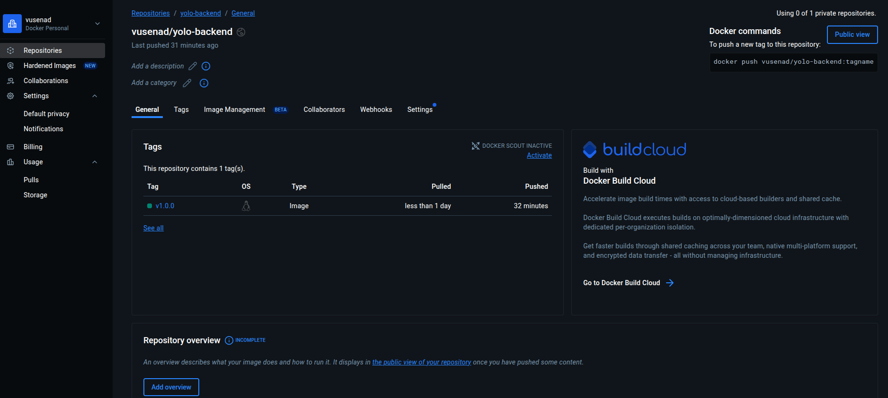

##  BACKEND CONTAINER
#  Comments one the choice of the base image on which to build the container.
For the backend container, I chose node:24-alpine as the base image. This is Node.js version 24 built on Alpine Linux, which is a very small and lightweight Linux distribution. Using Alpine keeps the final image size minimal while including Node.js pre-installed, so we do not have to install it manually. This choice ensures the container has the exact Node.js version we need and reduces overhead, making builds and deployments faster.

 # Dockerfile directives used

FROM node:18-alpine – Specifies the base image for the container.

WORKDIR /app – Sets the working directory inside the container to /app. All subsequent commands, like copying files or running scripts, will execute from this directory.

COPY package*.json ./ – Copies package.json and package-lock.json into the container. This allows installing dependencies without copying the entire source code first, which makes caching more effective.

RUN npm ci --production – Installs only production dependencies, keeping the image smaller and excluding development-only packages.

COPY . . – Copies all backend source files (server.js, routes/, models/, etc.) into the container.

EXPOSE 5000 – Documents the port that the backend service will listen on. This allows Docker or other services to know which port to map.

CMD ["node", "server.js"] – Sets the default command to run the backend server when the container starts.

# The backend image pushed to DockerHub as shown below

## CLIENT CONTAINER
#  Comments one the choice of the base image on which to build the container.
The client container uses two lightweight, production-grade base images to optimize both build and deployment:
node:18-alpine is used during the build stage. It’s chosen for its minimal size, fast performance, and compatibility with modern Node.js. This image provides a clean environment for installing dependencies and compiling the React app.

nginx:stable-alpine is used in the production stage. It’s ideal for serving static files efficiently, and is known for being lightweight, secure, and widely adopted in frontend deployments.

 # Dockerfile directives used
FROM node:18-alpine AS build - Begins the build stage using Node.js on Alpine Linux.

WORKDIR /app - Sets the working directory inside the container to /app.

COPY package*.json ./ - Copies the package configuration files to prepare for dependency installation.

RUN npm install - Installs all required project dependencies.

COPY . . - Copies the entire application source code into the container.

RUN npm run build - Compiles the React app into an optimized production build

FROM nginx:stable-alpine AS production - Starts the production stage using Nginx to serve the built static files.

COPY --from=build /app/build /usr/share/nginx/html - Transfers the compiled React build from the Node.js stage into Nginx’s default web directory.

EXPOSE 80 - Opens port 80 to allow HTTP traffic.

CMD ["nginx", "-g", "daemon off;"] - Sets the default command to run Nginx in the foreground and serve the application.

 # The backend image pushed to DockerHub as shown below

